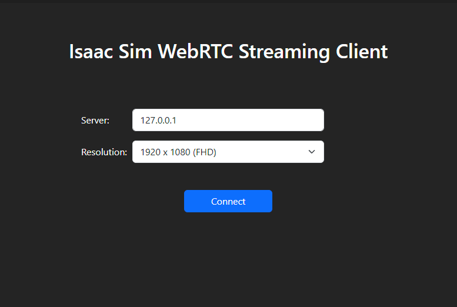

# nvidia_isaac-sim_ubuntu24.04
Run NVIDIA Isaac Sim 4.5.0 in a Docker container with Ubuntu 24.04 with other requirements satisfied by using [Isaac Sim Compatibility Checker](https://docs.isaacsim.omniverse.nvidia.com/latest/installation/download.html).<br>
In order to build the image, you can either follow the steps manually or run the bash script ``build.sh``. Make sure to meet all the prerrequisites.<br>
In order to run the container, you can run it manually as shown below or run the bash script ``run.sh``.<br>

# Specifications
NVIDIA GeForce RTX 4090<br>
Driver Version                            : 550.120<br>
CUDA Version                              : 12.4

# Prerequisites
- NVIDIA Drivers installation: https://ubuntu.com/server/docs/nvidia-drivers-installation<br>
GPU drivers version must be 535.129.03 or later, check it with:
```bash
nvidia-smi
```

- Docker installation and executing without sudo:
```bash
curl -fsSL https://get.docker.com -o get-docker.sh
sudo sh get-docker.sh
```
```bash
# Post-install steps for Docker
sudo groupadd docker # Create group
sudo usermod -aG docker $USER # Add current user to docker group
newgrp docker # Log in docker group
```
```bash
#Verify Docker installation
docker run hello-world
```

- NVIDIA Container Toolkit installation:
```bash
# Configure the repository
curl -fsSL https://nvidia.github.io/libnvidia-container/gpgkey | sudo gpg --dearmor -o /usr/share/keyrings/nvidia-container-toolkit-keyring.gpg \
  && curl -s -L https://nvidia.github.io/libnvidia-container/stable/deb/nvidia-container-toolkit.list | \
    sed 's#deb https://#deb [signed-by=/usr/share/keyrings/nvidia-container-toolkit-keyring.gpg] https://#g' | \
    sudo tee /etc/apt/sources.list.d/nvidia-container-toolkit.list \
  && \
    sudo apt-get update

# Install the NVIDIA Container Toolkit packages
sudo apt-get install -y nvidia-container-toolkit
sudo systemctl restart docker

# Configure the container runtime
sudo nvidia-ctk runtime configure --runtime=docker
sudo systemctl restart docker

# Verify NVIDIA Container Toolkit
docker run --rm --runtime=nvidia --gpus all ubuntu nvidia-smi
```

- Generate NGC API Key: https://docs.nvidia.com/ngc/ngc-overview/index.html#generating-api-key
- Log in to NGC:
```bash
docker login nvcr.io
```
```bash
Username: $oauthtoken
Password: <Your NGC API Key>
WARNING! Your password will be stored unencrypted in /home/username/.docker/config.json.
Configure a credential helper to remove this warning. See
credentials-store
Login Succeeded
```

# Isaac Sim version
``4.5.0``

# Docker version
``28.0.1``

# Build image
```bash
docker build -t {IMAGE_NAME}:{TAG} .
```

# Run container
Allow running graphic interfaces in the container:
```bash
xhost +
```
Run the container with the needed configuration:
```bash
docker run --name isaac-sim --entrypoint bash -it --gpus all -e "ACCEPT_EULA=Y" --rm --network=host   -e "PRIVACY_CONSENT=Y"   -v $HOME/.Xauthority:/root/.Xauthority   -e DISPLAY   -v ~/docker/isaac-sim/cache/kit:/isaac-sim/kit/cache:rw   -v ~/docker/isaac-sim/cache/ov:/root/.cache/ov:rw   -v ~/docker/isaac-sim/cache/pip:/root/.cache/pip:rw   -v ~/docker/isaac-sim/cache/glcache:/root/.cache/nvidia/GLCache:rw   -v ~/docker/isaac-sim/cache/computecache:/root/.nv/ComputeCache:rw   -v ~/docker/isaac-sim/logs:/root/.nvidia-omniverse/logs:rw   -v ~/docker/isaac-sim/data:/root/.local/share/ov/data:rw   -v ~/docker/isaac-sim/documents:/root/Documents:rw   isaac_sim_ros2:4.2.0-Humble
```

REMEMBER: if you want to share a folder between the host and the container, mount it adding the next flag to the previous command:
```bash
-v HOST_PATH:PATH_IN_CONTAINER
```
```bash
-v ~/Documents/isaac_sim/PROJECT_ID:~/PROJECT_ID
```

# Build and run with bash scripts
Add execution permissions:
```bash
chmod u+x build.sh run.sh
```

Build:
```bash
sudo -E ./build.sh 
```

Run:
```bash
sudo -E ./run.sh
```

# Run Headless mode
After getting into the Docker container, run `./runheadless.sh` in the `isaac-sim` directory. If it ran successfully, you will see a message that says, "Isaac Sim Full Streaming App is loaded”.

# Visualize GUI via Isaac Sim WebRTC Streaming Client
Download [Isaac Sim WebRTC Streaming Client](https://docs.isaacsim.omniverse.nvidia.com/latest/installation/download.html). Open the downloaded file, run 
```bash
./isaacsim-webrtc-streaming-client-1.0.6-linux-x64.AppImage --no-sandbox --enable-unsafe-swiftshader
```
and connect as shown below.




# Bibliography
https://docs.omniverse.nvidia.com/isaacsim/latest/installation/install_container.html

https://omniverse-content-production.s3-us-west-2.amazonaws.com/Assets/Isaac/Documentation/Isaac-Sim-Docs_2022.2.1/isaacsim/latest/install_ros.html

https://catalog.ngc.nvidia.com/orgs/nvidia/containers/isaac-sim

https://github.com/NVIDIA-Omniverse/IsaacSim-dockerfiles
